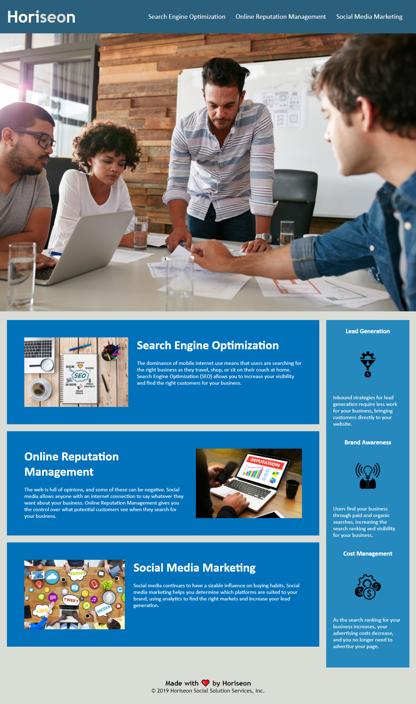

# Code Refactor Challenge
Given a code for a multi-column site without accessibility standards, unnecessarily repetitive code, and other elements to fix, this sample "Horiseon Social Solution Services" page has been updated with the likes of semantic HTML elements, alt attributes, and cleaned up CSS.\
Additionally, the page has been given a simple responsive code with a custom navigation toggle javascript and adjusted element sizes to better fit a variety of smaller screen sizes.

# View Live Page
[View the live code refractor challenge page on GitHub.](https://jcolecodes.github.io/blue-horizon/)

# Screenshot

